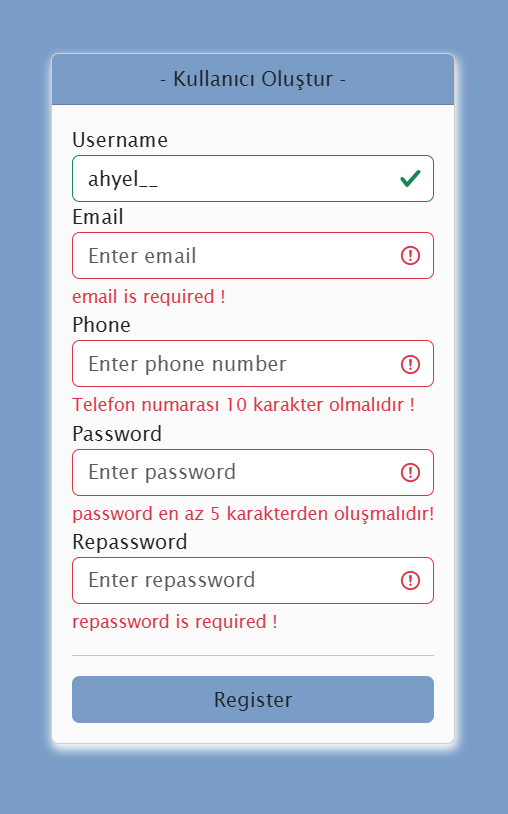

# JavaScript Form Validator
Bootstrap kullanılarak hazırlanmış basit ve kullanıcı dostu bir JavaScript form doğrulayıcı. 

## Proje Hakkında
Bu proje, Kullanıcıdan alınan verilerin doğruluğunu kontrol eder ve kullanıcılara geribildirim sağlar. Formda kullanıcı adı, e-posta, telefon numarası, şifre ve şifre tekrarı gibi alanlar bulunmaktadır. Kullanıcı bu alanları doğru şekilde doldurmazsa, ilgili hata mesajları görüntülenir.

## Özellikler
- Kullanıcı adı, e-posta, telefon numarası, şifre ve şifre tekrarının doğrulaması.
- E-posta formatının kontrolü.
- Şifrelerin eşleşip eşleşmediğinin kontrolü.
- Telefon numarasının 10 haneli olup olmadığının kontrolü.
- Alanların boş olmaması gerektiğini kontrol eder.
- Bootstrap 5 kullanılarak stil uygulanmıştır.

## Ne Öğrendim?
Bu projeyi geliştirirken aşağıdaki konularda bilgi ve deneyim kazandım:

- HTML, CSS, JavaScript ile temel web geliştirme becerileri.
- DOM manipülasyonu ile form elemanları üzerinde dinamik işlemler yapabilme.
- Bootstrap 5 ile tasarım oluşturma.
- Form doğrulama ve hata mesajları gösterimi.

  ## Ekran Görüntüleri

  
